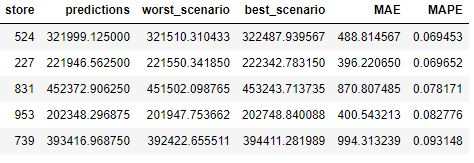
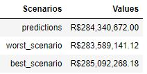

   

# Rossmann-Sales-Forecast

Previsão de Vendas das Próximas 6 Semanas para uma rede de farmacias.

  

# Conteúdo

<!--ts-->

1.  [Problema](#Contexto-do-Problema)
2.  [Entendimento do Problema](#Entendimento-do-Problema)
3.  [Dados](#Descricao-dos-Dados)
4.  [Planejamento da Solução](#Planejamento-da-Solução)
5.  [Hipóteses Principais](#Hipoteses-Principais)
6.  [Resultado](#Resultado)
7.  [Entrega da Solução](#Entrega-da-Solucao)
<!--te-->

# Contexto do Problema

A **Rossmann** é uma das maiores redes de drogarias da Europa, com cerca de 56.200 funcionários e mais de 4.000 lojas. Em 2019, a Rossmann faturou mais de € 10 bilhões na Alemanha, Polônia, Hungria, República Tcheca, Turquia, Albânia, Kosovo e Espanha.

# O Problema

Por se tratar de uma rede grande e de muito sucesso, o CFO e os diretos fazem muitas reuniões para acompanhemento e melhorias nas lojas da rede. Entre uma dessas reuniões, foi levantado que é hora de realizar uma reforma nas lojas, pensando nisso, o CFO da empresa fez uma reunião com todos os Gerentes de Loja e pediu para que cada um deles trouxessem uma previsão das próximas 6 semanas de vendas com o objetivo de determinar o budget para a reforma.

Após a reunião, os gerentes levaram o desafio ao time de ciencia de dados para criar um modelo que é capaz de prever as vendas das próximas 6 semanas.

# Entendimento do Problema

**Motivação:**

- A previsão de vendas foi requisitada pelo CFO em uma reunião mensal sobre os resultados das lojas.

**Causa Raiz do Problema:**

- Dificuldade em determinar o valor do investimento para reforma de cada Loja.

**Quem é o Stakeholder:**

- Diretor Financeiro (CFO) da Rossmann.

**Formato da Solução:**

- **Granularidade:** Previsão de vendas por Dia da Loja pra os próximos 42 dias, 6 semanas.
- **Tipo de Problema:** Previsão de Vendas.
- **Potênciais Métodos:** Séries Temporais, Regressão.
- **Formato da Entrega:** O valor das Vendas no final de cada 6º semana. E acesso as vendas através do Celular.

**Dados para resolver o problema:**

- Os dados estão no Kaggle e podem ser encontrados [aqui](https://www.kaggle.com/c/rossmann-store-sales/data).

# Descrição de Dados

O Dataset usado para este projeto possui 1017209 linhas e 18 colunas. Os dados contém:

| Atributo                  | Significado                                                                          |
| ------------------------- | ------------------------------------------------------------------------------------ |
| Store                     | id da loja                                                                           |
| DayOfWeek                 | dia da semana da venda                                                               |
| Date                      | dia, mês e ano da venda                                                              |
| Sales                     | nº de vendas                                                                         |
| Customers                 | nº de clientes                                                                       |
| Open                      | indica se a loja estava aberta ou fechada                                            |
| Promo                     | indica se uma loja está realizando uma promoção naquele dia                          |
| StateHoliday              | indica o feriado estadual                                                            |
| SchoolHoliday             | indica se a (Loja, Data) foi afetada pelo fechamento de escolas públicas             |
| StoreType                 | indica o tipo da loja                                                                |
| Assortment                | indica o nível de sortimento                                                         |
| CompetitionDistance       | indica a distância em metros dos competidores                                        |
| CompetitionOpenSinceMonth | indica o mês em que o concorrente mais próximo foi aberto                            |
| CompetitionOpenSinceYear  | indica o ano em que o concorrente mais próximo foi aberto                            |
| Promo2                    | indica se a loja está participando de promoção consecutiva/continua                  |
| Promo2SinceWeek           | indica a semana em que a loja começou a participar da promoção consecutiva/continua  |
| Promo2SinceYear           | indica o ano em que a loja começou a participar da promoção consecutiva/continua     |
| PromoInterval             | indica os intervalos consecutivos em que a promoção consecutiva/continua foi inciada |

# Planejamento da Solução

**1. Descrever os Dados:**

- Carregar o conjunto de dados que será utlizado, entender as variáveis disponíveis e verificar possíveis valores faltantes e inconsistências.
- Realizar uma estatística descritiva para entender as características dos dados.

**2. Levantar Hipóteses:**

- Criar Hipóteses sobre as características e o comportamento de venda nas lojas.
- Realizar um Feature Engineering para criar novas variáveis.

**3. Filtrar Dados:**

- Filtrar linhas e colunas de acordo com as restrições de negócio e com as premissas assumidas.

**4. Realizar Análise Exploratória de Dados:**

- Validar ou refutar as hipóteses através dos dados.
- Identificar correlação entre variáveis e a variável resposta.
- Obter insights.

**5. Preparar os dados**

- Fazer o reescalonamento das variáveis, aplicar Encoding e transformar os dados

**6. Selecionar as melhores Features**

- Aplicar o algoritmo Boruta para seleção de Features e adicionar os resultados com as variaveis julgadas importantes na fase de análise exploratória.

**7. Modelagem de Machine Leaning**

- Treinar, validar e aplicar cross validation nos algoritmos de média móvel, Regressão linear, Regressão Linear Regularizada, Random Forest Regressor e XGboost Regressor.

**8. Ajustar os Hiperparametros**

- Encontrar a melhor combinação de parametros para o modelo final usando a técnica de Random Search.

**9. Traduzir e Interpretar o erro**

- Transformar a performace de Machine Leaning para resultado de Negócio e trazer cenários da predição para auxilar a tomada de decisão do CFO.

**10. Deploy do Modelo em Produção**

- Deixar o modelo acessível para o CFO acessar os resultados do modelo de qualquer lugar.

# Premissas Assumidas

**Competidores nulos:** São lojas que não possuem um competidor próximo, portanto foram substituídos por 200mil metros.

**Venda igual a zero:** Foi filtrado as linhas com venda diferente de zero, pois nesse período a loja permanceu fechada por algum motivo.

**Clientes:** Foi excluído a coluna com o nº de clientes, devido a restrição de negócio por não ser possível saber a quantidade de clientes nas próximas 6 semanas.

# Hipóteses Principais

### H2. Lojas com competidores mais próximos vendem menos.

**FALSA** Lojas com competidores mais próximos vendem Mais.

  

### H4. Lojas com promoções ativas por mais tempo vendem mais

**FALSA** Lojas com promoções ativas por mais tempo vendem menos, depois de um certo período de promoção.

  

### H8. Lojas vendem mais ao longo dos anos.

**FALSA** Lojas vendem menos ao longo dos anos.

  

# Algoritmos de Machine Learning Aplicados.

Os modelo treinados foram:

- Regressão Linear.
- Regressão Linear Regularizada.
- Random Forest Regressor.
- XGBoost Regressor.

O modelo escolhido para resolver o problema da Rossman foi:

- XGBoost Regressor.

# Performace dos Modelos de Machine Learning

As métricas usadas para comparação dos resultados foram: MAE, MAPE, RMSE. Os resultados das performaces obtidas com a validação cruzada foi:

  

# Resultados

**Predição das próximas 6 semanas por Loja:**

Facilitando a tomada de decisão, é possível observar os possíveis cenários, para exemplificar com uma amostra de 5 lojas, a loja de código 524 tem a predição de 321k de vendas para as próximas 6 semanas com um erro de 7%, isso representa um erro de 488 em vendas. No melhor cenário, a loja 524 venderá 322k e no pior 321k em vendas.

  

**Predição das próximas 6 semanas no total:**

Para as vendas totais, a predição das próximas 6 semanas de todas as lojas é de 284M. No pior cenário, as vendas será de 283M e no melhor, será de 285M.

  

# Entrega da Solução

Deploy in construction.
